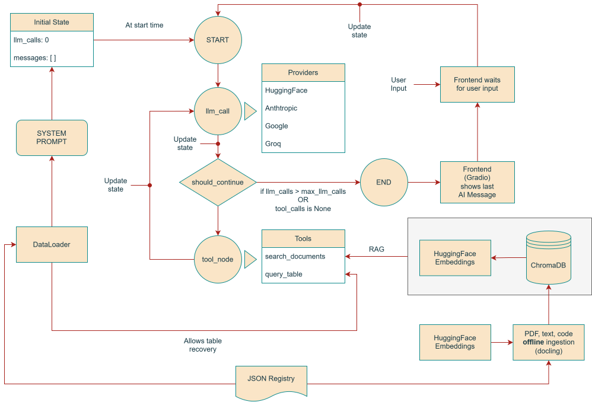

# Alzheimer's Disease Agent (ADgent)
ADgent is a ReAct RAG-based agent built with LangGraph that leverages a multimodal knowledge base (PDFs, CSVs, text and code files) and custom tools to retrieve information and provide specialized answers about Alzheimer's Disease biomarkers.

## System Overview

## Short Description

### Graph
The graph consists of two nodes: an LLM call node and a tool execution node. A conditional edge routes the graph to tool execution or terminates it. Two tools are available: an SQL-based query tool over structured data (powered by a dataloader layer) and a semantic search tool over a Chroma vector database. The state stores the conversation history and the number of LLM calls, and is initialized with a system prompt that includes a behavioural instruction and a description of the available data.

### Database and RAG
At ingestion time, all text-based documents defined in `registry.json` are processed by Docling to extract and chunk text. Each chunk is encoded into a vector representation by an embedding model and stored in a Chroma vector database. At runtime, the search_documents tool encodes the user query into the same vector space and retrieves the most semantically similar chunks, which are forwarded to the LLM to elaborate an answer.

### Frontend
The frontend is a Gradio chat interface that captures user input, passes it to the agent, and displays the final LLM response.

### Containerization
The system is containerized with Docker for reproducible deployment.
